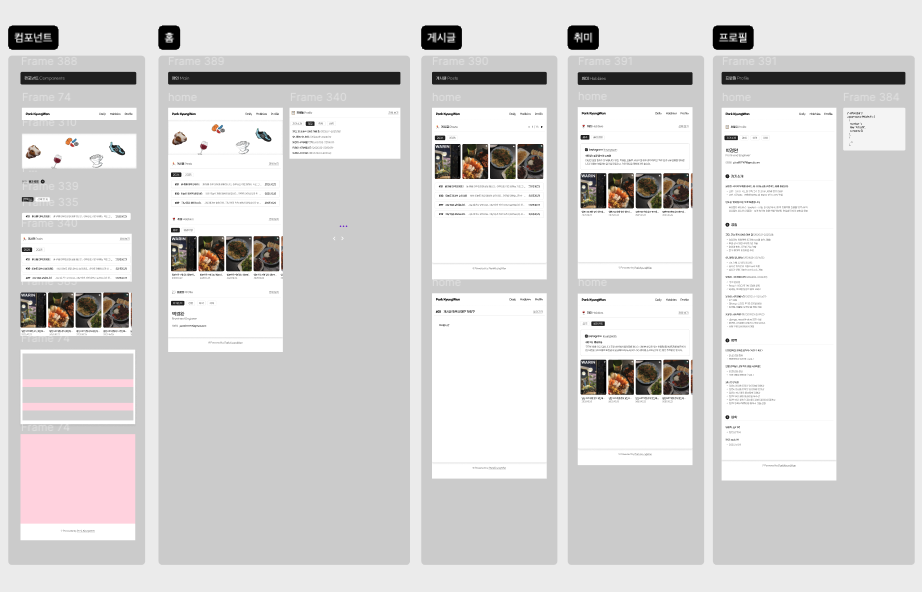
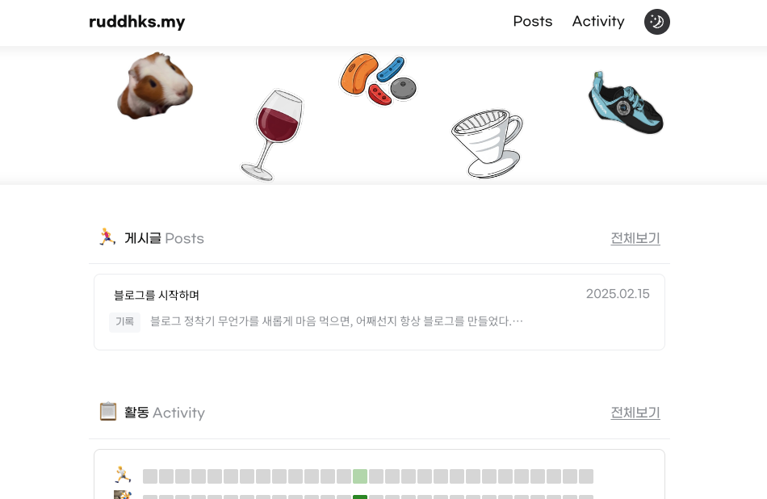
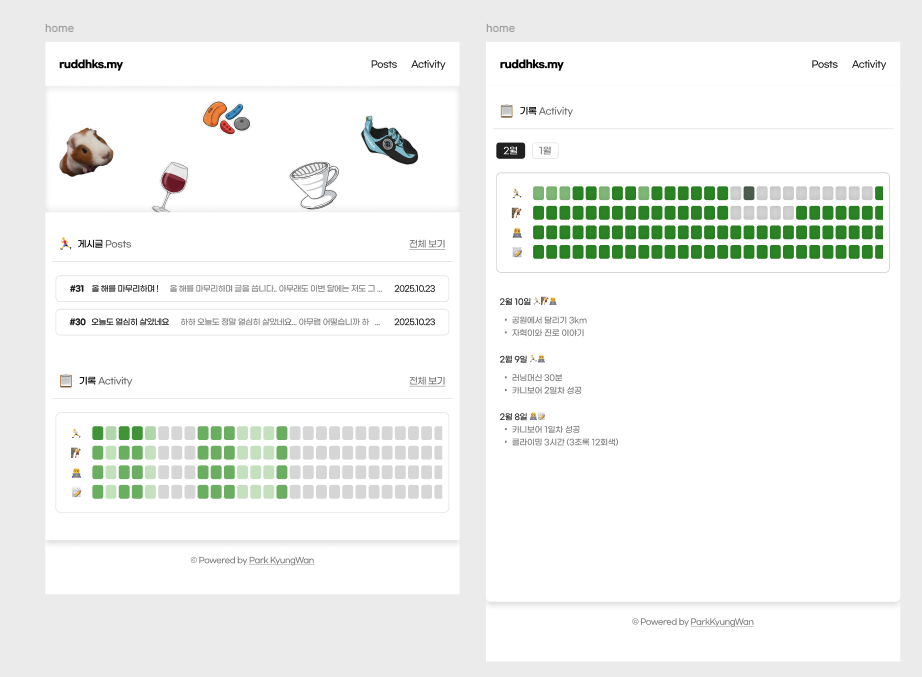

## 블로그 정착기

무언가를 새롭게 마음 먹으면, 어째선지 항상 블로그를 만들었다. [티스토리](https://successfu1.tistory.com) 에는 제대로 된 포트폴리오를 만들고 싶어서, 디버깅하는 내용을 적어보기도 하고, 독후감을 쓰기도 하고, 일기를 써보기도 하다가 결국에는 비공개 처리된 글이 대부분이고 목적이 애매해지고 말았다. <span style="opacity: 0.55;">(옛날에 쓴 글들은 뭔가 부끄러워서 자꾸 지우게 된다)</span>

[네이버 블로그](https://blog.naver.com/pkw7197) 에는 일상에서 찍은 사진들을 올린다. 한 달간의 일상을 최대한 재밌게 기록해보려고 만든 공간이다. 이것도 시간이 지나면 부끄러워서 과거에 썼던 글들은 비공개 처리했다.


---
---

## ✍️ 새로운 블로그, 디자인



블로그를 만들때마다, 디자인에 공을 들였다. 공을 들인다고 이쁘게 만들 수 있는 것도 아니지만 최선을 다했다. 그럼에도 이번 블로그가 특별한 이유는 나름대로 **취향**을 담으려고 노력했기 때문이다.

어떤 공간이 있으면 글을 쓰고 싶을까 고민했다. 먼저 블로그의 전반적인 형태가 **직관적이고 깔끔**하기를 바랐고, **평소에 쓰는 물건**이나 좋아하는 요소들로 포인트를 주면 어떨까 싶었다.

---
---

## 👀 메인 화면에 담긴 아이콘들



그렇게 메인을 완성했다. 아이콘은 나노바나나로 만들었다. 막 마음에 들지는 않아도 그럭저럭 괜찮아서 쓰기로 했다. 왼쪽부터 **기니피그, 와인, 클라이밍 홀드(?), 하리오 v60 드리퍼, 테나야 인달로 암벽화**가 되겠다.

전체적인 구조는 [단민님의 블로그 템플릿](https://jeong-min.com/)을 활용했다. 블로그 제작을 다짐하게 된 계기도 위 블로그를 보고나서였다. 처음 봤을 때 너무 깔끔하고 직관적이어서 기억에 남았다. 언젠가 나도 이런 블로그를 만들어 봐야겠다 싶었는데, 이젠 나도 커스텀 블로그 owner가 되었다.

---
---

## 📋 기록(Activity) 기능에 관하여



원래는 Activity가 아닌 Hobbies로 기획했었다. 인스타를 연동하려 했는데, 만들다보니 api 활용도 어려울 것 같고, Posts랑 기능이 겹치는 것 같아서 제외했다. 

대신 만들어진 Acitivity는 갑자기 [알고리즘을 타고 나타난 일본 영상](https://youtu.be/dq0flPVuJfg?si=pJnvJmAFnAgU7xTG)에서 영감을 받았다! 

매일 이루고자 하는 일들을 미리 정한 다음, 성취 정도를 평가한다(깃헙 activity와 비슷하다). 추가로 그 날의 하이라이트 몇 줄을 함께 적어서 기록한다. 영상 주인의 말에 따르면 해당 방법으로 폰중독에서 벗어날 수 있다고 한다. 

---
---

## 2026년, 값진 성취가 있길 바라며!

이번 블로그는 오랜 기간, 열심히 살아가는 기록들이 꾸준히 남았으면 한다 ✨. 

열심히 사는 것도, 꾸준히 기록하는 것도 모두 어렵겠지만, 뭐든 **꾸준함**이 가장 중요하다는 마음가짐으로 시작해보자. 취업/건강/행복 모두에서 만족스러운 한 해가 되기를!

---

```toc

```
