## 유튜브 채널 추천

커피를 직접 내려보기로 했다면, 가장 빠르게 돈을 쓰는 방법은 [유튜브 영상](https://www.youtube.com/watch?v=TfSBzFeoL4s)을 보는것이다. 4:6 레시피로 유명한 테츠 카스야인데 한국어 자막도 있다. **굳이 왜 일본 유튜버를 추천하느냐**라고도 할 수 있는데.. 섬세하게 알려주고 무엇보다 감성이 충만해서 지갑을 열기 좋다. 한국에서는 [인스타](https://www.youtube.com/watch?v=nn_ZHjp1yBw)라는 분이 유명하다.

---
---

## 💁‍♂️ Step1. 원두는 송도커피에서

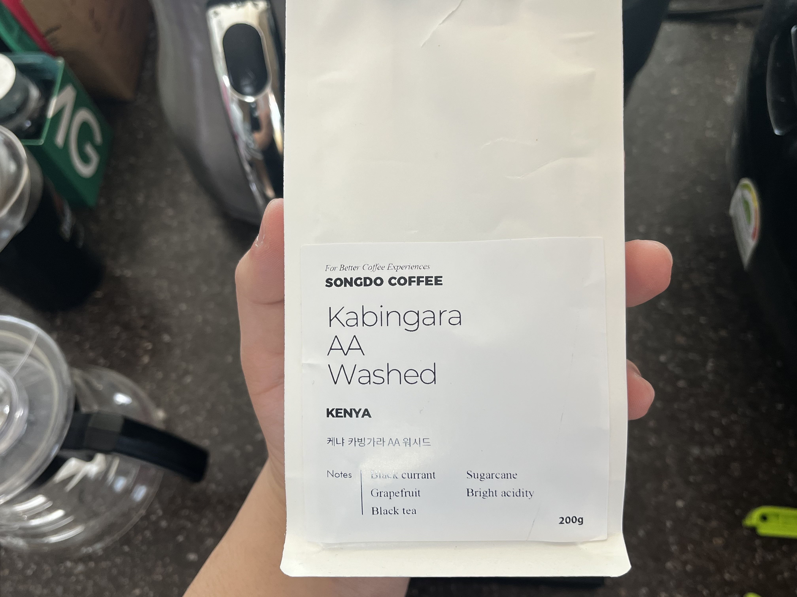

커피를 내리려면 일단 **원두**를 공수해야 한다. 오늘 내릴 커피는 송도커피에서 구매한 **케냐 카빙가라 AA워시드**가 되시겠다. 커피 이름은 어떻게 읽는 것이고, 또 어떻게 고르는 것인지 궁금할 수 있다. 어차피 공부한다고 해서 다 읽히는 것도 아니고.. 앞에 노트가 적혀 있으니 마음에 들면 구매하도록 하자. <span style="opacity:55%">(AA같은 등급 체계나 게이샤같은 주요 품종 몇 개만 알아두면 아주 살짝 도움이 된다)</span>

송도커피를 추천하는 이유는 오랜 단골이기 때문이다. 커피의 맛을 결정짓는 요인 중에는 원두의 퀄리티가 무엇보다 중요하겠지만, 일정 수준 이상부터는 '단골'이라는 감성 한 스푼을 더해줘야 그 이상의 만족감이 생겨나는 법이다.

---
---
## 🕛 Step2. 장비 추천

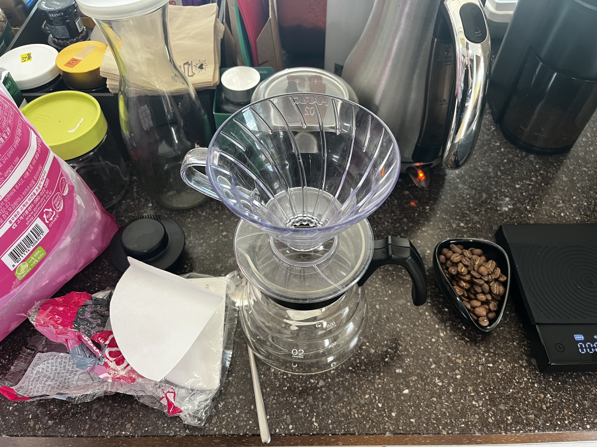

드리퍼는 **하리오v60**을 사용한다. 이유는 딱히 없다. 얘가 제일 유명하다. 다들 이거 쓰고 가격도 비싸지 않다. 쿠팡에 검색해서 구매하면 끝! 종이 필터도 그냥 세트로 구매하면 된다.

---

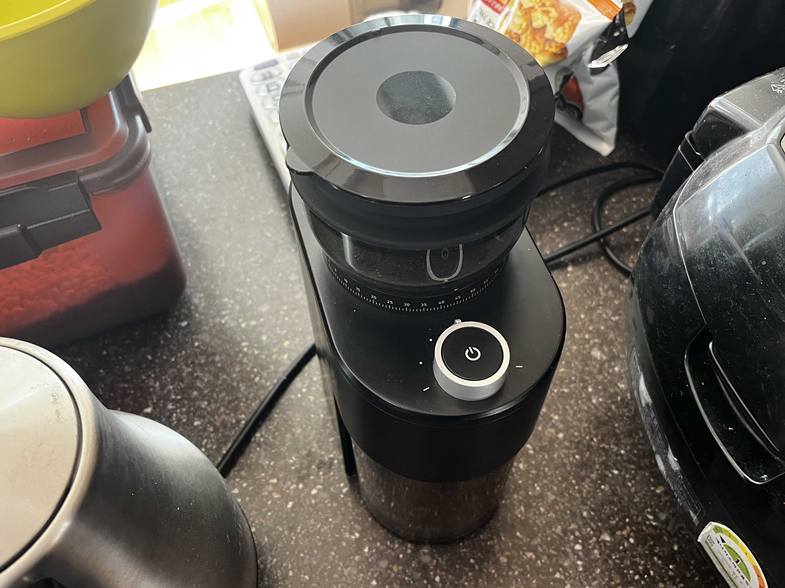

원두 분쇄기는 [홀츠클로츠 그라인더](https://smartstore.naver.com/holzklotz/products/10295260140?site_preference=device&NaPm=ct%3Dmlnde8jj%7Cci%3Dshopn%7Ctr%3Dmyz%7Chk%3D89b319aa0a88887e9c60b56f10eea1d5da455e51%7Ctrx%3Dundefined)를 사용한다. 원래 쿠팡에서 산 수동 분쇄기를 썼었는데, 여러 명 내려주려면 하루 종일 돌려야해서 손목 다 빠진다. 이번에 생일 선물로 사촌 형님께서 하사해 주신 전동 그라인더 덕분에 터널 증후군이 싹 고쳐졌다. 다만 아직 청소를 안해봤기 때문에 내부 청소가 어떨지는 모르겠다.

---

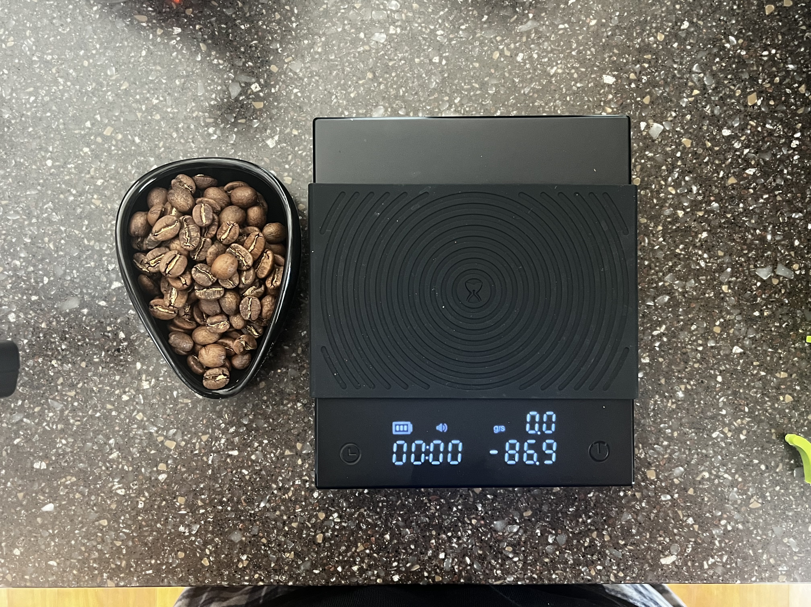

마지막으로 시헌이가 선물해준 [커피 저울](https://www.coupang.com/vp/products/9337564833?itemId=27689393331&vendorItemId=87541085634&q=%EC%BB%A4%ED%94%BC+%EC%A0%80%EC%9A%B8&searchId=167205be28878295&sourceType=search&itemsCount=36&searchRank=2&rank=2&traceId=mlndix8l)이다. 저울이 굳이 필요한가..라고 한다면 꼭 필요하지는 않는 것 같다. 나도 사실 저울을 선물받기 전까지만 해도 감으로 대충 내렸다. 원두가 괜찮으면 맛도 괜찮아서 크게 맛없어지거나 하지는 않는 것 같다.

근데!! 저울을 써서 레시피를 제대로 지켰더니 확실히 맛있어졌다; 이게 기분 탓인지 진짜 맛있어진건지는 여러분이 글쓴이의 혀에 대한 신뢰도를 바탕으로 재량껏 평가해주길 바란다. 본인의 경우에는 **저울 전** 보다 **저울 후**가 확실히 입에 착 감기고 일관된 맛이 나는 느낌이다.


---
---
## 🕜 Step3. 본격! 드립 레시피 (25g/280ml)

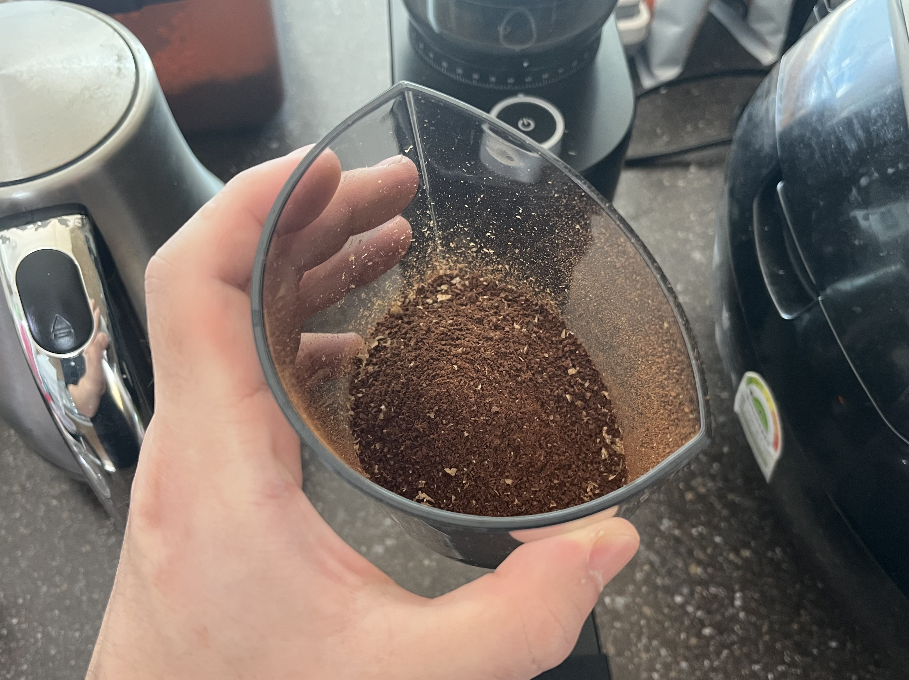

이 레시피는 **송도커피 원데이 클래스**에서 학습해왔다. 근데 필기를 제대로 안해서 레시피의 30%정도가 유실됐다. 이 점을 감안해서 조금 문제가 있을 수 있는 레시피라는 점을 양해해 주었으면 한다.

이 레시피는 커피 드리퍼에 **미리 얼음을 넣어 둔 상태**로 진행한다. (얼음은 80~100g 정도)

---

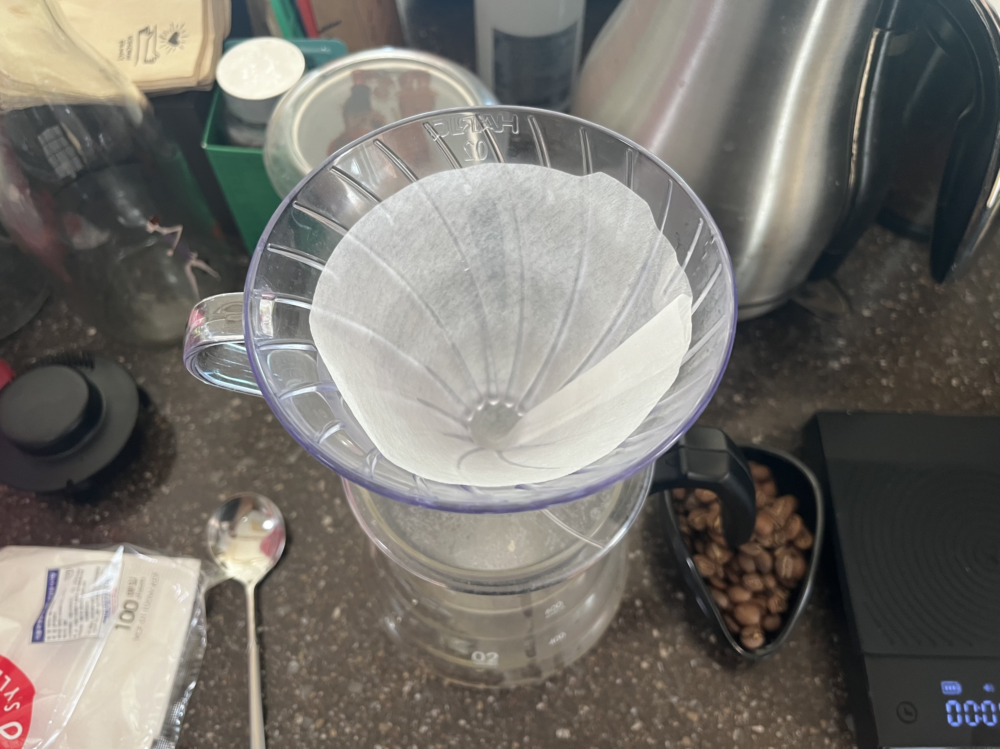
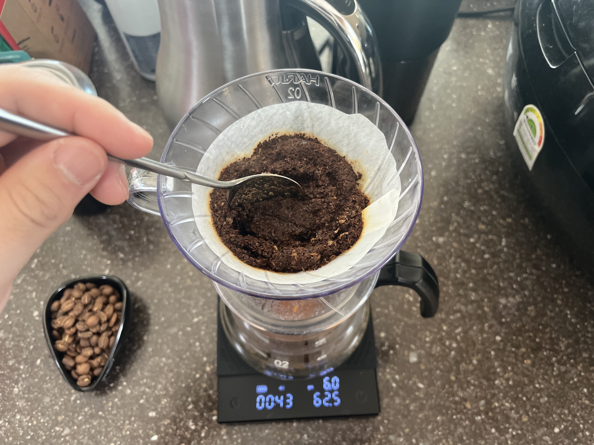

먼저 원두를 넣기 전에 **종이 필터를 올리고 뜨거운 물을 부어준다.** 린싱을 하는 공식적인 이유는 종이 냄새를 제거하기 위해서인데, 이에 관해서는 논란이 있는 듯 하다. 나의 경우에는 커피 필터가 드리퍼에 착! 감기는 느낌이 좋아서 계속 하고 있다. 종이가 드리퍼에 붙으면 바닥에 있는 뜨거운 물을 제거해준다.

바로 **뜸 들이기**를 시작하는데 **60ml**의 물을 넣고 타이머를 켜준다. 미리 결론을 이야기하자면 60ml/1분 뜸 들이기, 그 이후부터 30초마다 100ml, 80ml, 40ml를 부어주고 2분 30초에 마무리한다. <span style="opacity:55%">(뜸 들이기를 할 때 스푼으로 원두의 중앙을 꼭 섞어주도록 하자)</span>


---
---
## 🕓 Step4. 마무리

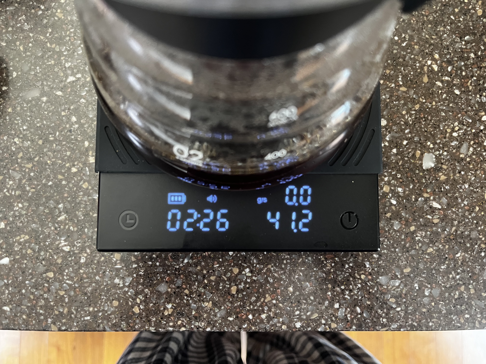

총 2분 30초짜리 레시피라 조금 빠른가? 싶기는 한데 나름대로 만족하고 있다. 완성된 커피는 **드리퍼가 시원해질 때까지 흔들어준 뒤에** 컵에 따라주면 끝이다.

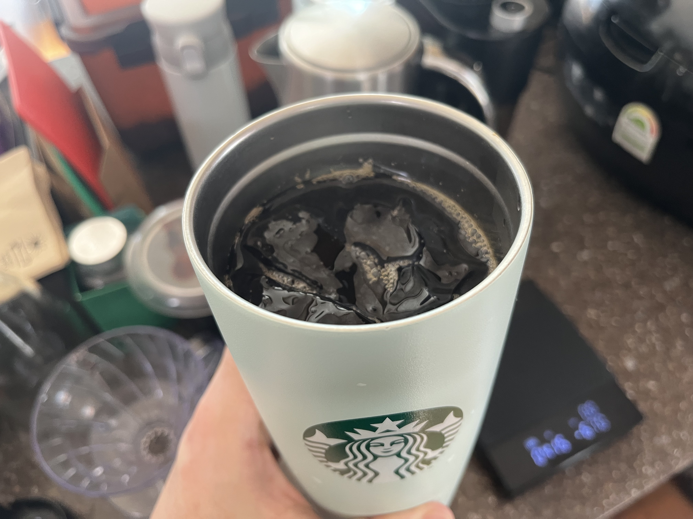

커피를 내리는 김에 부모님 커피도 한 잔 내린다면 동시에 효도가 가능하다. 드립 커피는 옆에서 관전하는 사람에게는 상당한 공수가 드는 작업으로 보여지기 때문에, 효도를 하거나 선물을 할 때에 받는 사람의 만족도가 상향된다는 장점이 있다.

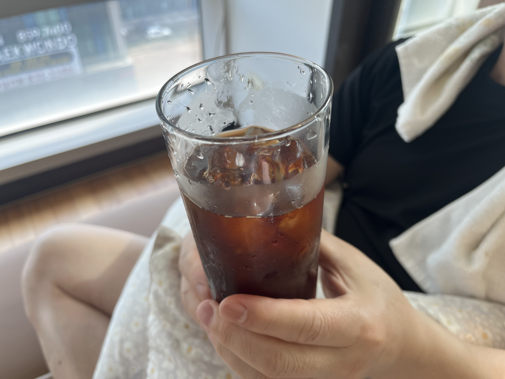


---
---

## 💰 커피를 저렴하게 즐기는 법

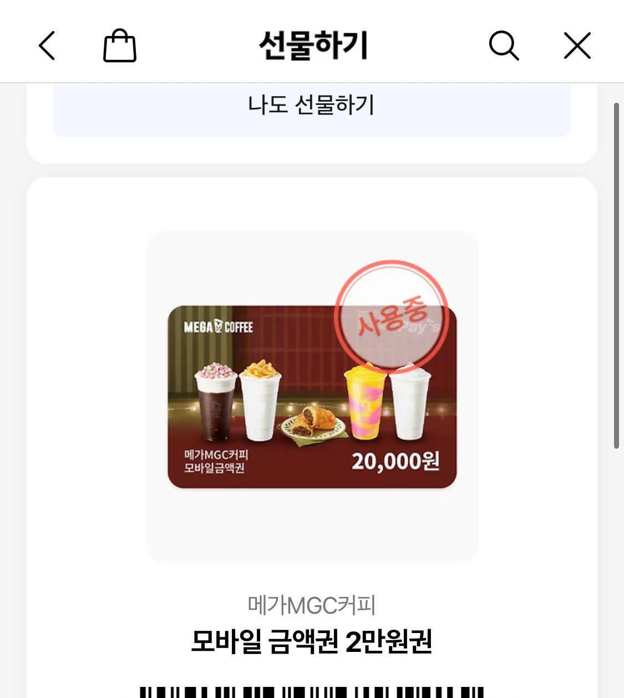

커피 생활을 **가장 행복하게 즐기는 방법**은, 누군가에게 메가커피 2만원권을 선물받는 것이다.

메가커피 기프티콘에 **SKT 멤버십 바코드**를 연계하면 20%의 할인이 적용되기 때문에 총 12번의 커피를 마실 수 있고, 12번을 모두 사용하고 나서도 800원이 남는다. 이 게시글을 보고 커피가 마시고 싶어졌다면, 누군가에게 메가커피 20000원권을 선물해보는 것은 어떨까.

평범한 20000원짜리 선물이지만, 선물을 받는 사람에게는 12번의 행복을 선물 받는 기분일 것이다.

---

```toc

```
